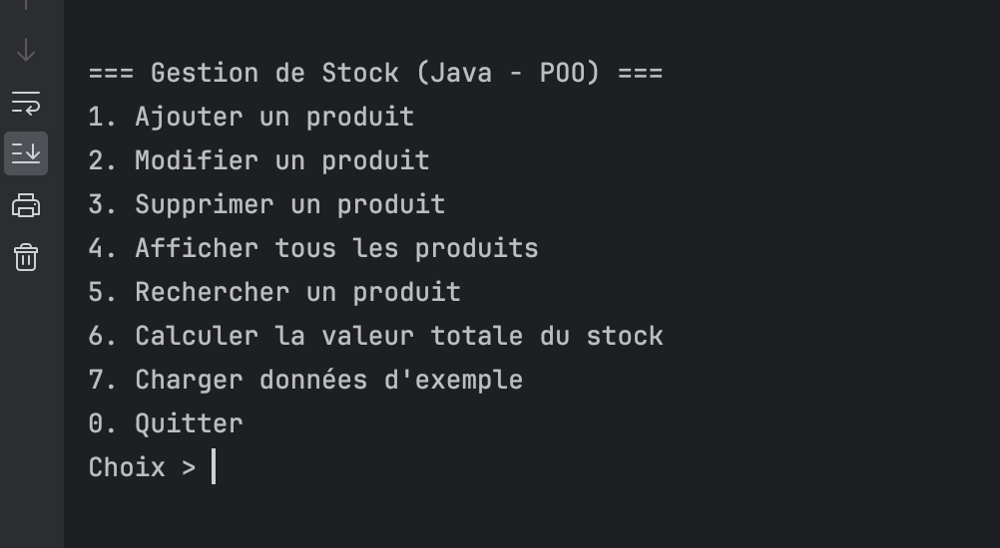
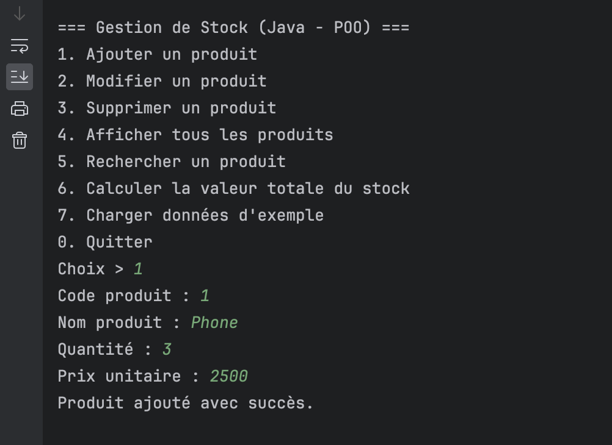
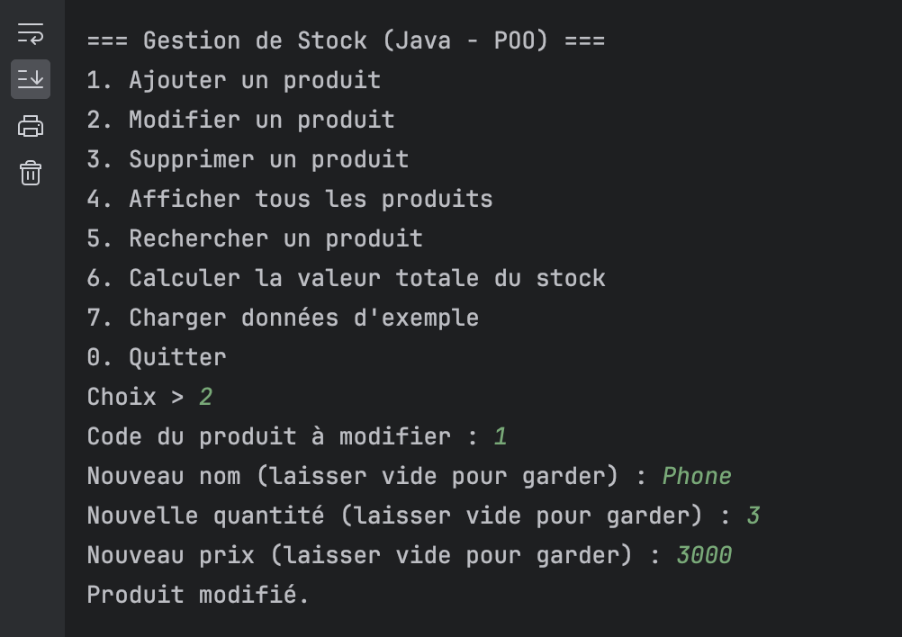
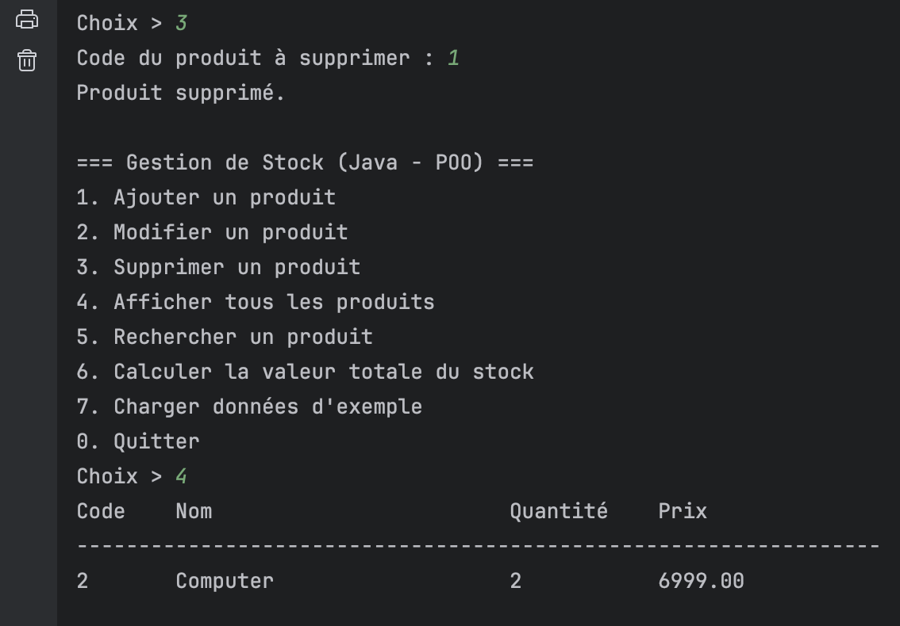
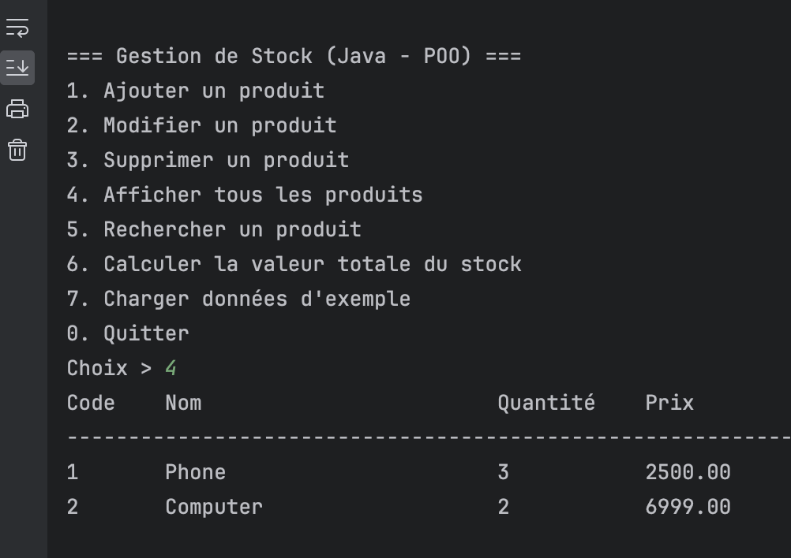
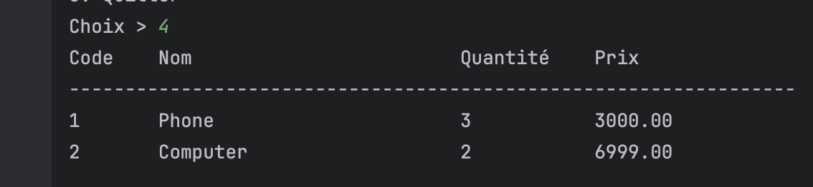
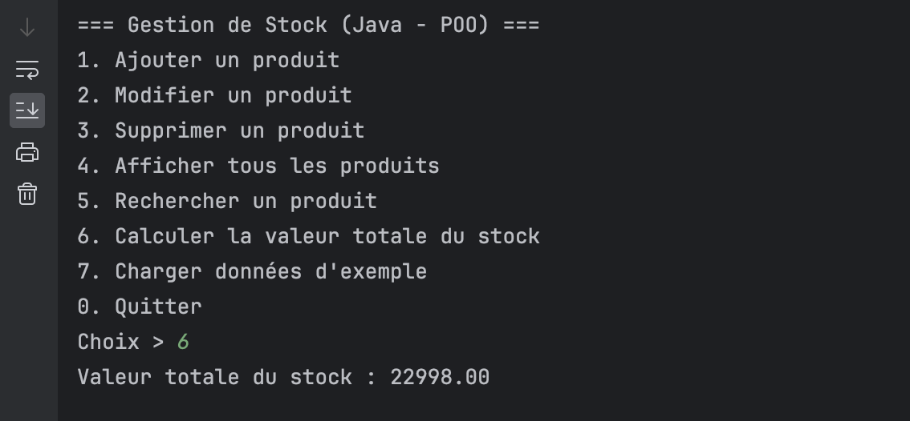

markdown
Copy
Edit
# 📦 Application de Gestion de Stock (Java - POO)

> Une application console Java pour gérer le stock d'une petite boutique en **programmation orientée objet**.  
> Utilise une classe `Product` et une liste dynamique (`ArrayList<Product>`).

---

## ✨ Fonctionnalités

- ➕ **Ajouter** un produit (code unique, nom, quantité, prix unitaire)
- ✏ **Modifier** un produit (par code, possibilité de laisser un champ inchangé)
- ❌ **Supprimer** un produit (par code)
- 📋 **Afficher** la liste complète des produits
- 🔍 **Rechercher** un produit par nom (recherche partielle, insensible à la casse)
- 💰 **Calculer la valeur totale** du stock (`quantité × prix`)
- 🗂 **Charger des exemples** de produits pour tester rapidement

---

## 🛠 Structure du projet

/src

└── Product.java # Classe représentant un produit<br>
└── Main.java # Logique principale + menu console

yaml
Copy
Edit

---

## 📦 Prérequis

- **Java JDK 8+** installé (`java -version` et `javac -version` doivent fonctionner)
- Un **terminal / console** ou un IDE comme IntelliJ IDEA, Eclipse ou VS Code

---

## 🚀 Compilation et exécution

1. **Téléchargez** ou clonez le projet :
   ```bash
   git clone https://github.com/youssef-baaziz/app-gestion-stock-java.git
   cd app-gestion-stock-java/src
Compilez les fichiers :

   ```bash
   javac Product.java Main.java
   ```
Exécutez le programme :

   ```bash
   java Main
   ```

📸 Captures d’écran<br>

1️⃣ Menu principal
(Ajoutez ici une capture d’écran du menu affiché au lancement)



2️⃣ Ajout d’un produit
(Exemple d’ajout d’un produit avec saisie des données)



3️⃣ Modification d’un produit
(Exemple où l’on change uniquement le prix et la quantité)



4️⃣ Suppression d’un produit
(Suppression d’un produit via son code)



5️⃣ Affichage des produits
(Liste tabulaire des produits avec colonnes Code / Nom / Quantité / Prix)



6️⃣ Recherche par nom
(Résultat de recherche partielle sur le nom)



7️⃣ Valeur totale du stock
(Affichage du calcul de la valeur totale)




